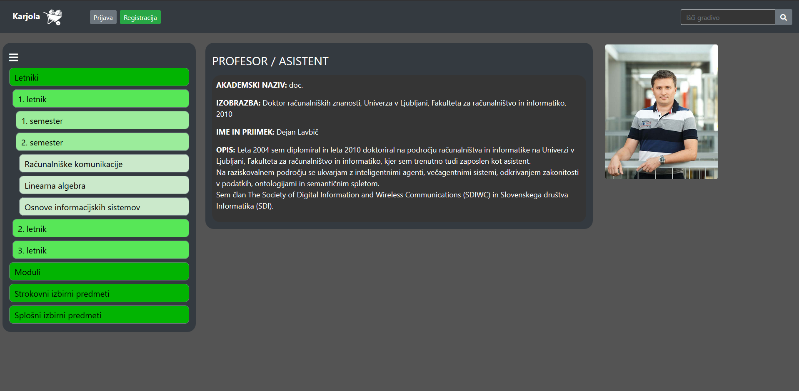
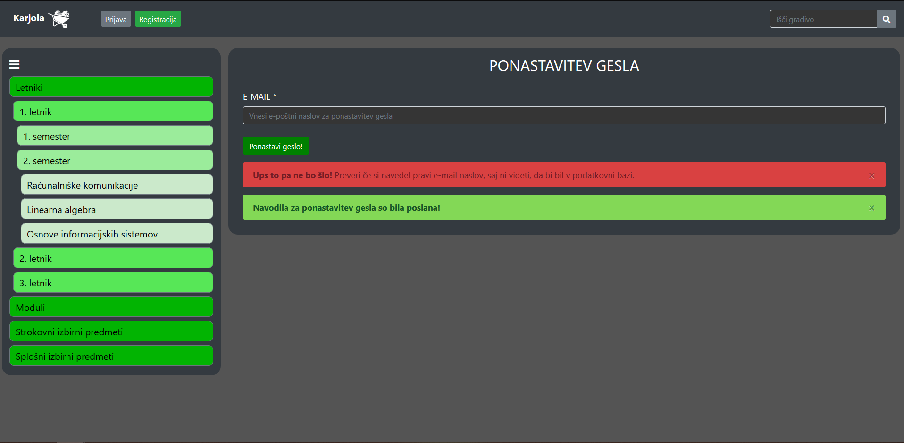
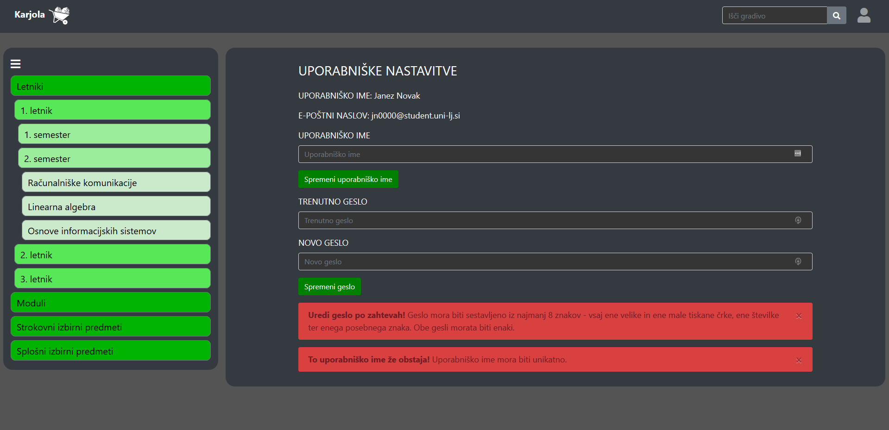

# Spletno programiranje 2020/2021

Dokumentacija lastnega projekta pri predmetu **Spletno programiranje** v študijskem letu **2020/2021**.

## 1. LP

Osnutek aplikacije in wireframe model

### Master/detail vzorec

Stranski meni omogoča navigacijo po predmetih. Vsak predmet je razvrščeni po: letniku, če je obvezen predmet za določen letnik; modulu, če je predmet modulski predmet; strokovnih/splošnih izbirnih predmetih, če je izbirni predmet. Če je smiselno, da kakšen predmet spada v več kategorij (npr. če se spremeni predmetnik, in predmet postane izbirni, zamenja modul itd.), bo dostopen v vseh kategorijah.

### Podrobnejši opisi zaslonskih mask

Dostopno vsem:

- Domača stran:
  - uvodni tekst za obiskovalce strani.
  
- Profesorji/asistenti (neregistriran uporabnik):
  - opis profesorja/asistenta: akademski naziv, izobrazba, ime in priimek, opis, slika
  - možnost ogleda, ni možnosti urejanja
  
- Splošni pogoji:
	- seznam pravil, splošnih pogojev uporabe spletne strani
	- za podrobnejši opis posamezne kategorije: klik na naslov
  
- Registracija:
  - Da se lahko uporabijo napredne funkcije, se je potrebno registrirati na spletno strani. Pri tem izpolnimo zahtevana vnosna polja
  - Odkljukati je potrebno tudi strinjanje s splošnimi pogoji. Če smo vse izpolnili, pritisnemo na gumb "Registriraj se"
  - V primeru napake se izpišejo ustrezna opozorila
  - Polje "Kraj" se izpolni s pomočjo [**zunanje storitve** ][1]. Če je poštna številka pravilna se izpiše ime kraja, sicer prikaže opozorilo
  
- Prijava:
  - Za prijavo vnesemo e-pošto in geslo, ki smo ga izbrali ob registraciji
  - Lahko izberemo, da ostanemo prijavljeni
  - V primeru napake se izpišejo ustrezna opozorila
  - Prijavimo se s klikom na gumb "Prijavi se"
  
- Ponastavitev gesla:
  - Vnesemo e-mail, ki se nahaja v podatkovni bazi in kliknemo na gumb "Ponastavi geslo". V primeru napak ali nepravilnega vnosa uporabnika spletna stran obvesti.
  
  - Uporabniku se prikažejo zanimive statistike različnih podatkov na grafikonih.
  
- Vnos novega gesla:
  - V obe polji vnesemo enako novo geslo, ki ustreza kriteriju: Geslo mora biti sestavljeno iz najmanj 10 znakov - vsaj ene velike in ene male tiskane črke, ene številke ter enega posebnega znaka.
  V primeru, da geslo ne ustreza kriterijem, se izpiše ustrezno opozorilo.
  
- Rezultati iskanja:
  - tabela gradiva, ki ustreza iskalnemu izrazu
  - tabela predmetov, povezanih z iskanim izrazom
  - tabela profesorjev in asistentov, povezanih z iskalnim izrazom
  
- Stran predmeta:
  - opis predmeta
  - seznam izvajalcev
  - seznam objavljenih dokumentov
    Vsak dokument ima:
    - gumb za prijavo neprimernega dokumenta
    - gumb za prenos datoteke
    - seznam komentarjev
      Vsak komentar ima:
      - uporabniško ime avtorja
      - datum in čas objave
      - vsebina komentarja
      - gumb za prijavo neprimernega komentarja
  
- Statistike
  - Grafi s statistikama razporeditve uporabnikov po krajih in razporeditve števila gradiv po predmetih
  

Dostopno prijavljenemu uporabniku:

- Uporabniške nastavitve:
  - vnosno polje in gumb za spremembo uporabniškega imena
  Če je uporabniško ime že zasedeno, se izpiše opozorilo.
  - vnosni polji in gumb za spremembo gesla. Polji za novo geslo in potrditev novega gesla morata vsebovati isto geslo.
  Če geslo ne ustreza kriterijem, ali se gesli ne ujemata, se izpiše opozorilo.

  
- Stran predmeta (uporabnik):
  Uporabnikova stran predmeta je povsem podobna navadni, ima pa še dodane:
  - polje za vpis komentarja pri vsakem dokumentu:
    - potrditveno polje, če uporabnik želi komentirati anonimno
    - gumb za objavo komentarja
  - polje za vpis URL povezave do gradiva na internetu
  - polje za nalaganje datoteke
  - gumb za objavo povezave oz. datoteke

  

Dostopno adminu:

- Admin management:
  - seznam profesorjev in asistentov
  - seznam predmetov
  - seznam modulov
  - pri vsakem seznamu možnost dodajanja novega elementa (s klikom na gumb 'Dodaj' se odpre obrazec za dodajanje)
  - vsak element seznama je možno urejati/brisati

  
- Profesorji/asistenti (admin):
	- opis profesorja/asistenta: akademski naziv, izobrazba, ime in priimek, opis, slika
	- možnost urejanja vsake kategorije posebej

  
- Stran predmeta (admin):
  Povsem podobno strani predmeta za navadnega uporabnika, z dodanimi gumbi za brisanje datotek in komentarjev, gumbom za skrivanje objavljenega gradiva pred drugimi ter z vidnim številom prijav posameznega dokumenta oz. komentarja.  

  
- Stran za urejanje predmeta:
  Obrazec za urejanje posameznega predmeta:
  - polje za ime predmeta
  - polje za nastavitev letnika, v katerem je predmet
  - polje za nastavitev tipa izbirnega predmeta, če je predmet izbirni
  - polje za nastavitev profesorja
  - polje za nastavitev asistentov
  - polje za določitev modulov, v katerih je predmet
  - polje za opis predmeta
  - gumb za shranjevanje predmeta
  - gumb za brisanje predmeta
  

## Testiranje aplikacije na različnih napravah

Aplikacije smo stestirali na virtualnih napravah:
- **iPhone 6/7/8** (na mobilnih napravah smo preverili tako **portrait** kot **landscape** način)
- **iPadu**
- **zaslonu resolucije 1920*1080**

Ugotovitve so naslednje:
- najbolj priporočljiva uporaba aplikacije je na zaslonih resolucije **1920*1080**, in sicer zaradi velikega števila elementov na posameznih straneh, saj je vsebina tako najbolj pregledna
- na mobilnih napravah se vsebina ustrezno prilagaja zaslonu zaradi uporabe Bootstrap komponent
- na iPadu se vsebina ustrezno prilagaja zaslonu zaradi uporabe Bootstrap komponent

## Testiranje aplikacije v različnih brskalnikih
Aplikacije smo stestirali v različnih brskalnikih:
- **Google Chrome**
- **Firefox**
- **Microsoft Edge (Chromium)**

Ugotovitve so naslednje:
- v brskalniku **Google Chrome** se vsebina ustrezno prikaže, vse funkcionalnosti aplikacije delujejo pravilno
- v brskalniku **Firefox** se vsebina ustrezno prikaže, vse funkcionalnosti aplikacije delujejo pravilno
- v brskalniku **Microsoft Edge (Chromium)** se vsebina ustrezno prikaže, vse funkcionalnosti aplikacije delujejo pravilno
- najbolj priporočljiva uporaba aplikacije je v brskalniku **Google Chrome**, saj je bila aplikacija razvita za ta brskalnik

## 2. LP
JavaScript in validacija uporabniških vnosov:
- Registracija, prijava ter obnovitev gesla:
  - Vsa polja morejo biti izpolnjena in ne smejo vsebovati HTML značk - izbrišemo besedilo kjer se pojavi HTML značka, iskalni vzorec pa je (/(<([^>]+)>)/ig).
  - Polje za uporabniško ime ima lahko poljubno besedilo, le da se uporabnik izbere unikatno ime (Kar se sicer preverja v podatkovni bazi in se vrne ustrezno opozorilo - za implementirat)
  - Polje za e-poštni naslov mora vsebovati e-poštni naslov, ki ga dobi študent s strani UL in je unikaten za vsekega študenta, preverja se pa z regularnim izrazom **[a-z]{2}[0-9]{4}@student.uni-lj.si**, primer veljavnega e-poštnega naslova bi tako bil "**ak3900@student.uni-lj.si**". Enako velja vnosno polje pri pozabljenem geslu (pozabljenoGeslo.html).
  - Geslo morabiti sestavljeno iz ene velike in ene male tiskane črke. Vsebovati mora tudi eno števko in en poseben znak iz nabora "@€#&!" ali drugi "posebni" znak, hkrati pa mora biti vsaj dolgo 8 znakov. Regularni izraz za preverjanje tega je "**^(?=.*[a-z])(?=.*[A-Z])(?=.*[0-9])(?=.*[!@€#\$%\^&\*])(?=.{8,})**" primer veljavnega gesla pa je "**AleksanderKovac97€**", ko preverjamo drugo geslo, če je seveda to potrebno (pri prijavi tega ni potregno preverjati), pa sam preverimo je enako prvemu. Če sta oba pogoja izpoljnjena, smemo napredovati. Enako se zahteva pri vnosu novega gesla, ko uporabnik želi nastaviti novo geslo.
  - Pri naslovih uporabniku, damo proste roke, saj je različno število besed tvori naslove (Kajuhova ulica, Ulica heroja Mohorja), hkrati pa je možno hišnim številkam dodati tudi črko (npr. 519a), naselja izven kraja pošte imajo tudi več besed v samem nazivu. Našim ciljnim uporabnikom pa je znan tudi pojem **doxing**, tako, da tu ne pričakujemo smiselnega odgovora, pričakujemo pa vsaj nek tekst.
  - Poštna številka je sestavljena iz štirih števk **(/^\d{4}$/)**
  - Kraja ne moremo sami vnašati, saj se ta pridobi preko **zunanjega APIja**, ki ga gostuje doc. dr. Dejan Lavbič. Ob pravilni poštni številki se v polje izpiše kraj, sicer pa ustrezno opozorilo.
  - Za uporabo strani pa se moramo strinjati s splošnimi pogoji, pri čemer, mora biti izpolnjeno potrditveno polje.
- Prijava, pozabljeno geslo in vnos novega gesla:
  - polja se preverjajo z enakimi regularnimi izrazi in na enak način kot pri registraciji.
- Uporabniške nastavitve:
  - Pri spremembi uporabniškega imena je edini pogoj, da je polje izpolnjeno.
  - Pri vnosu novega gesla morejo biti izpolnjena vsa polja, ustrezati pa morajo regularnemu izrazu "**^(?=.*[a-z])(?=.*[A-Z])(?=.*[0-9])(?=.*[!@€#\$%\^&\*])(?=.{8,})**. Primerne vrednosti so na primer: "AnotherRound12##", "Phoenix176#" in npr. "Predator12#".
- Admin management:
	- profesorji in asistenti:
		- za uspešno oddajo obrazca morajo biti izpolnjena vsa polja
		- polje 'izobrazba' mora ustrezati regularnemu izrazu : /(dipl|mag|dr)\.\s(([a-zčšž]+\.|[a-zčšž]+)\s?)+/
		- polje 'ime in priimek' mora ustrezati regularnemu izrazu: /\b([A-Z][-,a-z. ']+[ ]*)+/
	- predmeti: za uspešno oddajo obrazca morajo biti izpolnjena vsa polja z izjemo polj za asistente in module
	- moduli: za uspešno oddajo obrazca mora biti izpolnjeno polje za ime modula
	
- Admin profesor/asistent nastavitve:
	- za uspešno oddajo obrazca morajo biti izpolnjena vsa polja
	- polje 'izobrazba' mora ustrezati regularnemu izrazu : /(dipl|mag|dr)\.\s(([a-zčšž]+\.|[a-zčšž]+)\s?)+/
	- polje 'ime in priimek' mora ustrezati regularnemu izrazu: /\b([A-Z][-,a-z. ']+[ ]*)+/
	- ob izbrisu profesorja/asistenta mora uporabnik potrditi izbris na pojavnem oknu (Window Alert)

- Predmet nastavitve:
  - za uspešno oddajo obrazca in posodobitev predmeta morajo biti izpolnjena vsa polja z izjemo polja za urejanje asistentov in modulov
  - ob izbrisu predmeta mora uporabnik potrditi izbris predmeta na pojavnem oknu (Window Alert)

- Stran predmeta:
  - nalaganje gradiva:
    - Za uspešno oddajo obrazca se preverja velikost datoteke; ta ne sme presegati 16MB. Možno je nalaganje spletnega naslova ali pa nalaganje datoteke. Za uspešno pošiljanje obrazca mora biti vnešena natanko ena vrsta gradiva.
  - komentiranje:
     - Za uspešno oddajo obrazca mora biti vnešeno besedilo komentarja. Pošiljanje praznega besedila ni dovoljeno.
  
- Iskanje
 - Tekstovno polje za iskanje ne omejuje, kaj lahko uporabnik vpiše. 

### Dodatno uporabljeni paketi s spletnega mesta npmjs
Poleg obveznih npm paketov smo uporabili tudi druge npm pakete:
  - [Nodemailer][2]: s pomočjo nodemailerja pošljemo uporabniku povezavo za ponastavitev gesla.  Uporabnik najprej navede ustrezen mail, nakar aplikacija generira žeton za obnovo gesla, ki pošlje uporabniku s pomočjo nodemailer-ja na študentski mail UL, ki ga je uporabnik posredoval.
 [1]:https://api.lavbic.net/docs/#/Kraji
 [2]:https://www.npmjs.com/package/nodemailer

## 3. LP

Dinamična spletna aplikacija s podatkovno bazo

### Povezava do aplikacije v produkcijskem okolju na platformi Heroku

https://sp-lp24-karjola.herokuapp.com/

### Navodila za namestitev in zagon aplikacije v lokalnem okolju s pomočjo orodja Docker

Za zagon aplikacije v okolju Docker je potrebno standardno orodje ``docker-compose``. Za zagon aplikacije se moramo z ukazno vrstico premakniti v korensko mapo repozitorija, nato pa poženemo ukaz ``docker-compose up --build`` in počakamo, da se avtomatsko izvede izgradnja ter zagon aplikacije in podatkovne baze.
